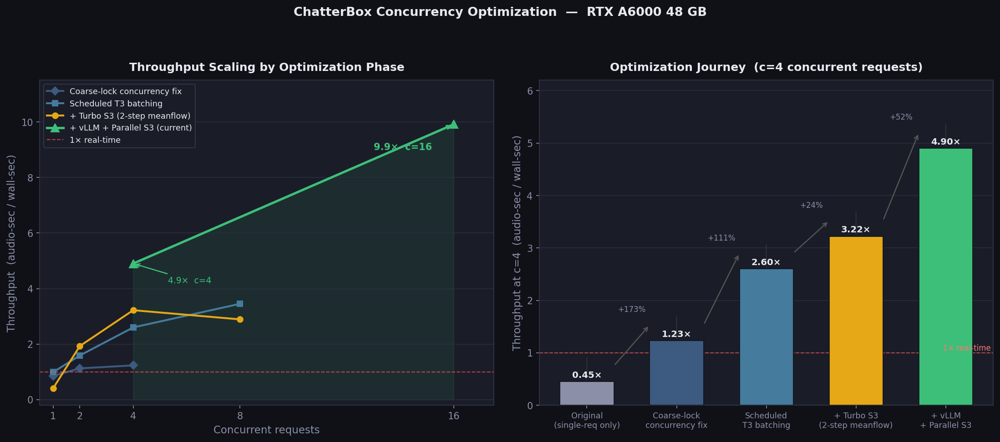

# ChatterBox Concurrency

**High-throughput concurrent TTS on a single GPU using vLLM batching + parallel S3 finalization.**

---

## The Problem

[Chatterbox](https://github.com/resemble-ai/chatterbox) is an open-source multilingual TTS system built on a two-stage architecture:

- **T3** — a transformer that converts text tokens into discrete speech tokens
- **S3** — a flow-matching vocoder that converts speech tokens into mel spectrograms and then waveforms via HiFiGAN

Out of the box, Chatterbox can only handle **one request at a time**. Each request occupies the GPU from start to finish before the next one begins. Under any real concurrent load, requests queue up and per-request latency degrades linearly with queue depth.

The root causes:

1. **T3 has no batching** — each request runs its own autoregressive decode loop, one token at a time, on the full GPU
2. **S3 finalization is sequential** — even if T3 could batch, the mel synthesis step ran one request after another in a Python for-loop
3. **No admission scheduler** — requests were not grouped or co-scheduled; the runtime had no concept of concurrent sessions

---

## The Solution

This repo replaces the original Chatterbox runtime with a serving stack that handles many concurrent requests at GPU-native speed:

### 1. vLLM for T3 Batching

The T3 transformer is exported as a vLLM-compatible causal LM and served through vLLM's `AsyncLLMEngine`. This enables:

- **True cross-request batching** — N concurrent T3 decodes run as a single `(N, seq_len)` forward pass, not N separate passes
- **Continuous batching** — requests arriving at different times are grouped into shared decode steps automatically
- **CUDA graphs** — with `VLLM_ENFORCE_EAGER=false`, the decode kernel is fused via CUDA graphs giving ~47% latency reduction at c=4

The T3 model uses an embed-only prompt path (`prompt_embeds` tensor, no token IDs) to carry voice conditioning through the vLLM engine.

**Stack note:** this uses the **standard multilingual T3** weights (not a turbo T3), paired with the **turbo S3 meanflow** checkpoint (`ResembleAI/chatterbox-turbo`, `s3gen_meanflow.safetensors`). Turbo S3 runs a 2-step ODE solver instead of the default 10-step, making S3 ~5× faster while keeping quality.

### 2. Parallel S3 Finalization

After the batched T3 decode, each request still needs its own S3 inference (speech tokens → mel → wav). These are independent and embarrassingly parallel. We run them concurrently using a `ThreadPoolExecutor` with one `torch.cuda.Stream` per worker:

```
T3 decode (vLLM batched): [req0, req1, req2, req3] → one GPU pass
                                       ↓
S3 finalize (parallel):   req0 ──┐
                          req1 ──┤→ all run concurrently on separate CUDA streams
                          req2 ──┤
                          req3 ──┘
```

This eliminated `s3_finalize_wait_s` from **0.719s → 0.001s** at c=4.

### 3. Chunked Streaming

Text is split at natural boundaries (sentence punctuation → clause punctuation → word cap) before inference. Each chunk is synthesized independently and streamed back as an NDJSON event immediately on completion. The first audio arrives after ~1.5s regardless of total text length.

---

## Performance

Historical optimization measurements were run on **NVIDIA RTX A6000 (48 GB)**.
Latest validation also includes **NVIDIA RTX 4060 Ti (16 GB)** to show how the
same stack behaves on a smaller-memory card.

### Before vs After (c=4 concurrent requests)

| Metric | Baseline (original Chatterbox) | This repo |
|--------|-------------------------------|-----------|
| First chunk latency | ~4.5s (full text) | **~1.6s** (first chunk) |
| T3 decode (c=4) | 4 × ~2.0s serial | **~1.0s** batched |
| S3 finalize wait | ~0.72s (sequential queue) | **~0.001s** (parallel) |
| Throughput (c=16) | ~1.0× audio real-time | **~9.9× audio real-time** |
| Requests at once | 1 | 16+ |

### Key Measurements (c=2, n=4, CUDA graphs enabled)

```
first_chunk_s (mean):        1.71 s
s3_finalize_wait_s (mean):   0.0009 s
s3_token2mel_s (mean):       0.383 s
s3_hift_s (mean):            0.177 s
```

### Throughput Scaling (same text, CUDA graphs enabled)

| Concurrency | T3 batch size | T3 decode time | Total wall time | Audio RT factor |
|-------------|--------------|----------------|-----------------|-----------------|
| 1           | 1            | ~0.6s          | ~2.0s           | ~3.3×           |
| 4           | 4            | ~1.0s          | ~3.5s           | ~5.4×           |
| 16          | 16           | ~1.1s          | ~7.4s           | **~9.9×**       |

T3 decode time barely increases from c=1 to c=16 — that's the vLLM batching effect.

### Cross-GPU Validation (Arabic stream_chunks, April 2026)

Workload used for the table below:

- endpoint: `/v1/tts/stream_chunks`
- texts:
  - `صباح الخير. هذا اختبار قصير للصوت.`
  - `هل يبدو الصوت طبيعيًا عندما ينتقل من سؤال إلى جواب؟ هذا ما نريد التأكد منه.`

| GPU | Concurrency | Requests | first_chunk_s (mean) | total_s (mean) | RTF (mean) | wall_s |
|-----|-------------|----------|----------------------|----------------|------------|--------|
| RTX A6000 (historical baseline) | 4 | n/a | ~1.6s | ~3.5s | ~5.4x | n/a |
| RTX A6000 (historical baseline) | 16 | n/a | n/a | ~7.4s | ~9.9x | n/a |
| RTX 4060 Ti (16 GB) | 4 | 8 | 2.08s | 5.02s | 0.51x | 11.89s |
| RTX 4060 Ti (16 GB) | 8 | 16 | 4.15s | 7.04s | 0.37x | 15.28s |
| RTX 4060 Ti (16 GB) | 16 | 32 | 5.59s | 10.15s | 0.26x | 22.79s |

Interpretation:

- The system still scales correctly on 4060 Ti (all requests completed at c=16).
- On 16 GB VRAM, higher concurrency pushes queueing and S3 finalize wait up, so
  first-chunk latency rises faster than on A6000.
- This is capacity-limited scaling, not a scheduler correctness issue.

### Baseline vs vLLM (Same GPU, April 2026)

Direct comparison on the same **RTX 4060 Ti (16 GB)** using `/v1/tts`:

- Baseline endpoint: `http://127.0.0.1:8001/v1/tts` (basic local FastAPI).
- Optimized endpoint: `http://127.0.0.1:8000/v1/tts` (vLLM + scheduler path).
- Workload: same two Arabic prompts used above.
- Request volume per run: `num_requests = 4 * concurrency`.
- vLLM run policy: one single-request warmup sent before each measured run.

| C | Baseline mean total (s) | Ours mean total (s) | Mean speedup | Baseline req/s | Ours req/s |
|---|--------------------------|---------------------|--------------|----------------|------------|
| 1 | 4.642 | 1.318 | 3.52x | 0.215 | 0.759 |
| 2 | 9.072 | 1.301 | 6.97x | 0.205 | 1.536 |
| 4 | 18.038 | 1.834 | 9.84x | 0.200 | 2.180 |
| 8 | 38.065 | 3.135 | 12.14x | 0.186 | 2.371 |
| 16 | 81.092 | 5.400 | 15.02x | 0.173 | 2.817 |

Key read:

- vLLM is faster at every tested concurrency level, and the advantage grows with load.
- At `c=16`, baseline queue wait dominates (`~75.31s` mean server queue wait), while vLLM remains much lower (`~2.28s`).
- This validates that the optimized path is not just lower-latency at `c=1`; it preserves throughput as concurrency increases.

### Performance Chart



**Left** — throughput (audio-seconds synthesized per wall-second) as concurrency grows, traced across all four optimization phases.  
**Right** — throughput at c=4 for each phase showing the step-by-step improvement.

Each phase built on the previous:

| Phase | What changed | Throughput at c=4 |
|-------|-------------|-------------------|
| Original | Single-request only, no concurrency | ~0.45× |
| Coarse-lock fix | Requests run concurrently; T3 still locked per-request | 1.23× |
| Scheduled T3 batching | T3 cohorts batched together; GPU-local alignment state | 2.60× |
| + Turbo S3 | S3 synthesis ~5× faster via 2-step meanflow ODE | 3.22× |
| + vLLM + Parallel S3 | True T3 cross-request batching via vLLM; S3 on parallel CUDA streams | **4.9×** (4 reqs) / **9.9×** (16 reqs) |

The "scheduled T3 batching" phase is what first enabled multiple requests to share T3 compute — the scheduler groups concurrent requests into cohorts and runs their T3 decodes in a single batched forward pass. Adding turbo S3 on top then unlocked the full throughput potential of that batching by removing the S3 bottleneck. vLLM replaced the custom T3 scheduler with a production inference engine that handles continuous batching automatically.

---

## Installation

### Prerequisites

- NVIDIA GPU (tested on RTX A6000 48GB)
- CUDA 12.1+
- Python 3.10+
- `conda` or `venv`

### 1. Create environment

```bash
conda create -n chatterbox-vllm python=3.10 -y
conda activate chatterbox-vllm
```

### 2. Install PyTorch

```bash
pip install torch==2.5.1 torchvision torchaudio --index-url https://download.pytorch.org/whl/cu121
```

### 3. Install vLLM

```bash
pip install vllm==0.17.1
```

### 4. Install Chatterbox (no-deps editable install)

```bash
# From the repo root:
pip install -e external/chatterbox --no-deps
pip install -r external/chatterbox/requirements.txt
```

### 5. Set environment variables

```bash
export HF_TOKEN=your_huggingface_token
export LD_LIBRARY_PATH=/usr/local/cuda/lib64${LD_LIBRARY_PATH:+:$LD_LIBRARY_PATH}
export VLLM_WORKER_MULTIPROC_METHOD=spawn
```

---

## Setup: Export T3 for vLLM

The T3 transformer must be exported to a vLLM-compatible format before the service can start. This only needs to be done once.

```bash
python -c "
from chatterbox.vllm_t3_bridge import export_vllm_t3_model
export_vllm_t3_model(
    ckpt_dir='path/to/chatterbox/weights',
    output_dir='runs/vllm_t3_export',
)
print('Export complete: runs/vllm_t3_export')
"
```

The export creates a directory with model weights + a `config.json` that registers the custom `ChatterboxT3ForCausalLM` architecture with vLLM.

---

## Setup: Turbo S3 Checkpoint

Download the meanflow S3 checkpoint from HuggingFace:

```bash
python -c "
from huggingface_hub import snapshot_download
import os
path = snapshot_download(
    repo_id='ResembleAI/chatterbox-turbo',
    allow_patterns=['s3gen_meanflow.safetensors'],
    token=os.getenv('HF_TOKEN'),
)
print('Turbo S3 cached at:', path)
"
```

---

## Starting the API

```bash
export VLLM_ENFORCE_EAGER=false          # enable CUDA graphs (~47% speedup)
export VLLM_ENABLE_PREFIX_CACHING=false  # required: prefix caching breaks embed-only prompts
export VLLM_GPU_MEMORY_UTILIZATION=0.85
export VLLM_MAX_MODEL_LEN=2048
export CHATTERBOX_CKPT_DIR=path/to/chatterbox/weights
export CHATTERBOX_VLLM_MODEL_DIR=runs/vllm_t3_export

uvicorn external.chatterbox.fastapi_vllm_tts_service:app \
    --host 0.0.0.0 --port 8000 --workers 1
```

The service prints `Model loaded` when ready (typically 30–60s for vLLM engine init).

---

## Testing the API

### Health check

```bash
curl http://localhost:8000/health
```

### Single request (full text)

```bash
curl -X POST http://localhost:8000/v1/tts \
  -H "Content-Type: application/json" \
  -d '{"text": "Hello, this is a test of the TTS system.", "language_id": "en"}' \
  --output output.wav
```

### Chunked streaming (low latency)

```bash
python external/chatterbox/stream_chunks_client.py \
  --url http://localhost:8000/v1/tts/stream_chunks \
  --text "Hello, this is a test of the chunked streaming endpoint." \
  --language-id en \
  --output-dir /tmp/chunks
```

### Concurrent load test

```bash
python external/chatterbox/stream_chunks_client.py \
  --url http://localhost:8000/v1/tts/stream_chunks \
  --text "This sentence will be synthesized concurrently by multiple clients." \
  --language-id en \
  --concurrency 8 \
  --requests 16 \
  --output-dir /tmp/load_test
```

### Preview chunk boundaries (debug)

```bash
curl -X POST http://localhost:8000/v1/tts/split_preview \
  -H "Content-Type: application/json" \
  -d '{"text": "Hello world. How are you today? I am doing great.", "language_id": "en"}'
```

---

## API Endpoints

| Method | Path | Description |
|--------|------|-------------|
| GET | `/health` | Service health check |
| POST | `/v1/tts` | Synthesize full text, return WAV |
| POST | `/v1/tts/stream` | Synthesize full text, stream audio bytes |
| POST | `/v1/tts/stream_chunks` | Split + synthesize per chunk, stream NDJSON events |
| POST | `/v1/tts/split_preview` | Preview chunk boundaries without synthesis |
| GET | `/v1/tts/trace/recent` | Last N batch scheduler traces |
| GET | `/v1/tts/meta` | Service metadata and model config |

### Chunked streaming event format

Each line from `/v1/tts/stream_chunks` is a JSON object:

```json
{
  "event": "chunk",
  "request_id": "abc123",
  "chunk_index": 0,
  "text": "Hello, this is a test.",
  "audio_wav_b64": "<base64 WAV>",
  "sample_rate": 22050,
  "queue_wait_s": 0.002,
  "t3_s": 0.95,
  "s3_s": 0.56,
  "chunk_total_s": 1.52,
  "is_final": false
}
```

---

## Architecture

```
HTTP request
     │
     ▼
FastAPI service
     │
     ▼
Admission scheduler  ←── batches concurrent requests into cohorts
     │
     ▼
Text chunker  ←── splits text at sentence/clause/word boundaries
     │
     ▼
┌────────────────────────────────────┐
│  T3 (vLLM, batched across N reqs)  │  ← shared GPU decode step
│  text tokens → speech tokens       │
└────────────────────────────────────┘
     │  N independent token sequences
     ▼
┌────────────────────────────────────┐
│  S3 finalize (parallel, N streams) │  ← N CUDA streams simultaneously
│  speech tokens → mel → wav         │    token2mel (meanflow, 2-step ODE)
└────────────────────────────────────┘    HiFiGAN mel → waveform
     │  N waveforms
     ▼
NDJSON stream (one event per chunk per request)
```

---

## Configuration Reference

| Environment Variable | Default | Description |
|---------------------|---------|-------------|
| `VLLM_ENFORCE_EAGER` | `false` | Set `true` to disable CUDA graphs (slower but safer for debugging) |
| `VLLM_ENABLE_PREFIX_CACHING` | `false` | Must remain `false` — prefix caching is incompatible with embed-only prompts |
| `VLLM_GPU_MEMORY_UTILIZATION` | `0.85` | Fraction of VRAM for vLLM KV cache |
| `VLLM_MAX_MODEL_LEN` | `2048` | Maximum T3 sequence length |
| `VLLM_TENSOR_PARALLEL_SIZE` | `1` | Tensor parallel shards (multi-GPU) |
| `CHATTERBOX_CKPT_DIR` | — | Path to base Chatterbox weights |
| `CHATTERBOX_VLLM_MODEL_DIR` | — | Path to exported vLLM T3 model |
| `CHATTERBOX_TURBO_S3_DIR` | — | Path to turbo S3 checkpoint (auto-downloaded if unset) |
| `HF_TOKEN` | — | HuggingFace token for checkpoint download |

---

## Repository Layout

```
external/chatterbox/
  src/chatterbox/
    runtime/
      worker_vllm.py          ← vLLM worker: batched T3 decode + parallel S3 finalize
    models/
      t3/                     ← T3 transformer
      s3gen/                  ← S3 flow-matching vocoder (turbo meanflow)
    mtl_tts_vllm_turbo_s3.py  ← top-level TTS class
    vllm_t3_bridge.py         ← vLLM engine setup + T3 export
  fastapi_vllm_tts_service.py ← FastAPI service with scheduler + streaming
  stream_chunks_client.py     ← load test + streaming client

GPU_MIGRATION_SERVING_PLAN.md ← full serving runbook
CLOUD_GPU_QUICKSTART.md       ← cloud GPU quickstart
SERVING_HANDOFF_2026-04-03.md ← checkpoint paths, env vars, audit findings
```
