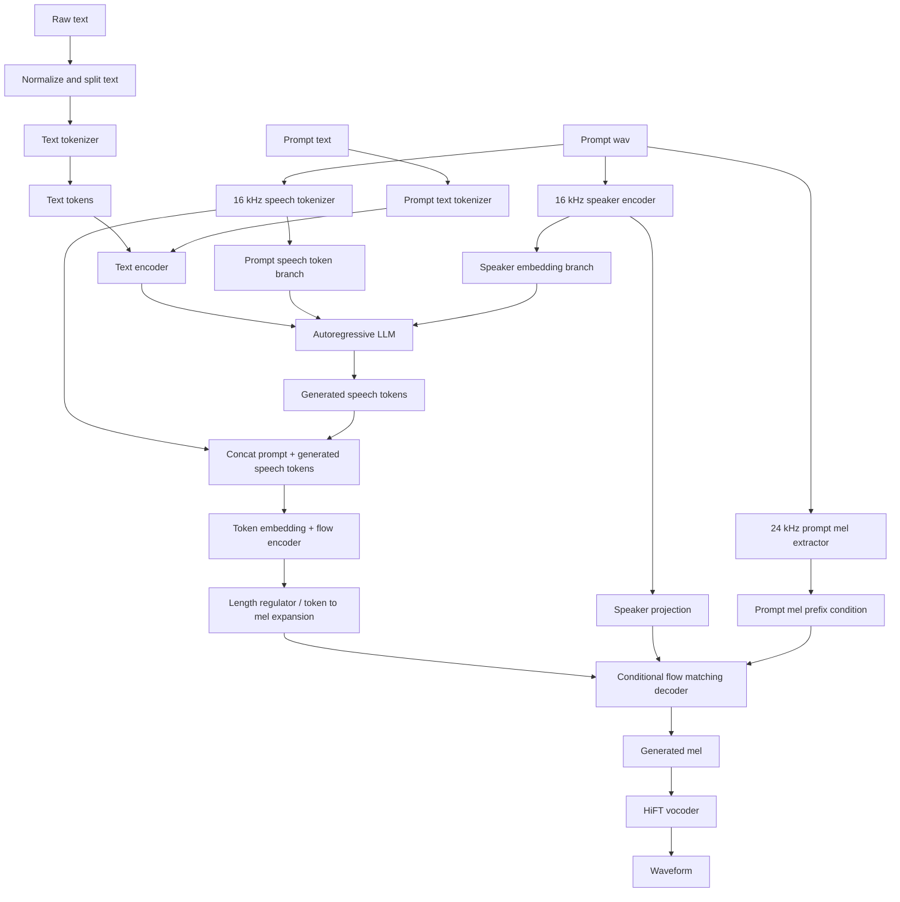
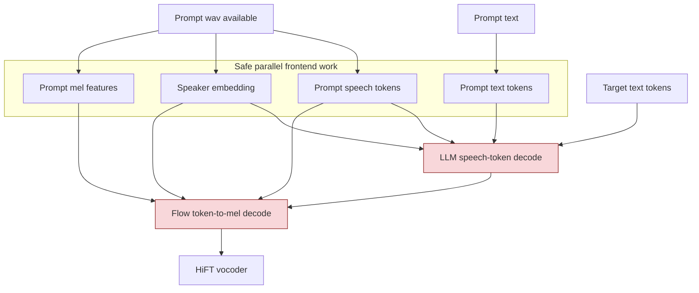

# CosyVoice Linear And Parallel Breakdown

This note is intentionally narrow.

- Main target: the `CosyVoice` v1 style path in the local repo and `CosyVoice_v1.pdf`.
- Code ground truth: the local `external/CosyVoice/` source.
- Useful contrast: `CosyVoice2` and `CosyVoice3` only where they show the repo's existing streaming and overlap strategy.

## Agent Note

- I am `Agent 1`.
- HM asked me to hyper-focus on CozyVoice and explain exactly how it works linearly, step by step, and whether there is a real parallel way to run it.
- This file is my focused handoff for that task.

## Executive Read

CosyVoice is not one model pass.

It is a staged stack:

1. text and prompt preprocessing
2. autoregressive speech-token generation
3. speech-token to mel conversion
4. mel to waveform vocoding

The important architectural point is this:

- the front-end branches can be parallelized
- the LLM speech-token decoder is sequential
- the flow decoder is also sequential across solver steps
- the flow decoder runs on the longer mel timeline, not the shorter token timeline

So the stack is serial twice:

1. text -> speech tokens
2. speech tokens -> mel

That is why simple kernel tuning does not remove the core scaling problem.

## Source Anchors

- Frontend preprocessing:
  - `external/CosyVoice/cosyvoice/cli/frontend.py`
- Runtime orchestration:
  - `external/CosyVoice/cosyvoice/cli/model.py`
- v1 LLM speech-token decoder:
  - `external/CosyVoice/cosyvoice/llm/llm.py`
- v1 flow token-to-mel:
  - `external/CosyVoice/cosyvoice/flow/flow.py`
  - `external/CosyVoice/cosyvoice/flow/length_regulator.py`
  - `external/CosyVoice/cosyvoice/flow/flow_matching.py`
  - `external/CosyVoice/cosyvoice/flow/decoder.py`
- vocoder:
  - `external/CosyVoice/cosyvoice/hifigan/generator.py`

## Linear Pipeline

### Step 1: Normalize and split input text

`CosyVoiceFrontEnd.text_normalize` cleans and chunks text before model inference.

What happens:

- language-dependent normalization
- punctuation cleanup
- number expansion
- paragraph splitting into manageable segments

This is the first place where long input gets broken into smaller sequential jobs.

Code:

- `external/CosyVoice/cosyvoice/cli/frontend.py:127`

### Step 2: Tokenize the target text

`_extract_text_token` converts the normalized text into token IDs for the text side.

Code:

- `external/CosyVoice/cosyvoice/cli/frontend.py:78`

### Step 3: Preprocess the prompt branches

For zero-shot mode, `frontend_zero_shot` builds several prompt-conditioned inputs.

It does four separate jobs:

1. tokenize prompt text
2. extract prompt speech tokens from `16 kHz` audio
3. extract prompt speaker embedding from `16 kHz` audio
4. extract prompt acoustic features from `24 kHz` audio

These branches are independent in dataflow, even though the current code runs them one after another.

Code:

- `external/CosyVoice/cosyvoice/cli/frontend.py:168`
- prompt text tokenization: `external/CosyVoice/cosyvoice/cli/frontend.py:171`
- prompt speech features: `external/CosyVoice/cosyvoice/cli/frontend.py:172`
- prompt speech tokens: `external/CosyVoice/cosyvoice/cli/frontend.py:173`
- prompt speaker embedding: `external/CosyVoice/cosyvoice/cli/frontend.py:179`

### Step 4: Build the LLM input sequence

In v1, the LLM does not directly emit waveform or mel.
It emits discrete speech tokens.

The LLM input is built from:

- `SOS`
- speaker embedding
- encoded text
- task token
- optional prompt speech tokens

Code:

- `external/CosyVoice/cosyvoice/llm/llm.py:162`
- text encoding: `external/CosyVoice/cosyvoice/llm/llm.py:182`
- speaker conditioning: `external/CosyVoice/cosyvoice/llm/llm.py:185`
- prompt speech token embedding: `external/CosyVoice/cosyvoice/llm/llm.py:196`
- final input concat: `external/CosyVoice/cosyvoice/llm/llm.py:200`

### Step 5: Autoregressively decode speech tokens

This is the first hard serial stage.

The code loops token by token:

- run one causal LM step
- project logits
- sample one next speech token
- append it
- feed that token back as the next input

Code:

- decode loop starts at `external/CosyVoice/cosyvoice/llm/llm.py:206`
- causal LM call: `external/CosyVoice/cosyvoice/llm/llm.py:211`
- next-token sampling: `external/CosyVoice/cosyvoice/llm/llm.py:215`
- feedback of generated token: `external/CosyVoice/cosyvoice/llm/llm.py:223`

Architecturally, this means speech-token generation for one utterance is not parallel across time.

### Step 6: Concatenate prompt tokens with generated tokens

The flow model uses both:

- prompt speech tokens
- newly generated speech tokens

The v1 token-to-mel path concatenates them before encoding.

Code:

- `external/CosyVoice/cosyvoice/flow/flow.py:117`

### Step 7: Project speaker embedding and embed token IDs

Before token-to-mel decoding:

- the speaker embedding is normalized and projected
- speech token IDs are embedded
- padding mask is applied

Code:

- speaker projection: `external/CosyVoice/cosyvoice/flow/flow.py:113`
- token embedding: `external/CosyVoice/cosyvoice/flow/flow.py:120`

### Step 8: Encode tokens into hidden states

The flow-side encoder converts token embeddings into contextual token states.

In v1, this is still on the token timeline.

Code:

- `external/CosyVoice/cosyvoice/flow/flow.py:123`

### Step 9: Expand token-rate states to mel-rate states

This is the first major sequence expansion.

The code computes:

- `mel_len1` from prompt mel length
- `mel_len2` from generated token length and frame-rate conversion

Then `InterpolateRegulator.inference` upsamples token-rate hidden states to mel-rate hidden states.

Code:

- mel-length computation: `external/CosyVoice/cosyvoice/flow/flow.py:126`
- length regulator call: `external/CosyVoice/cosyvoice/flow/flow.py:127`
- interpolation logic: `external/CosyVoice/cosyvoice/flow/length_regulator.py:52`

This is the point where the decoder leaves the cheap token timeline and moves to the more expensive mel timeline.

### Step 10: Build the acoustic condition tensor

The prompt mel features are inserted as a fixed acoustic prefix condition.

So the flow model sees:

- mel-rate conditioning sequence `mu`
- prompt mel prefix `cond`
- speaker embedding

Code:

- `external/CosyVoice/cosyvoice/flow/flow.py:129`

### Step 11: Initialize noise and run conditional flow matching

This is the second hard serial stage.

The flow module:

- initializes a noise tensor `z`
- constructs a timestep schedule
- runs an Euler solver for `n_timesteps=10`
- updates the whole mel tensor at every step

Code:

- v1 flow call with `n_timesteps=10`: `external/CosyVoice/cosyvoice/flow/flow.py:135`
- noise init and timestep schedule: `external/CosyVoice/cosyvoice/flow/flow_matching.py:56`
- Euler loop: `external/CosyVoice/cosyvoice/flow/flow_matching.py:101`
- per-step estimator call: `external/CosyVoice/cosyvoice/flow/flow_matching.py:109`

This is serial because step `k + 1` depends on the mel state produced by step `k`.

### Step 12: Run the estimator on the whole mel-length sequence

Inside each flow step, the estimator is not a tiny head.

It is a U-Net-like stack with:

- time embedding
- packed input of `x`, `mu`, speaker condition, and prompt condition
- down path with ResNet blocks and transformer blocks
- mid blocks
- up path with skip connections
- final projection back to mel channels

Code:

- estimator input packing: `external/CosyVoice/cosyvoice/flow/decoder.py:228`
- down path: `external/CosyVoice/cosyvoice/flow/decoder.py:241`
- mid path: `external/CosyVoice/cosyvoice/flow/decoder.py:260`
- up path: `external/CosyVoice/cosyvoice/flow/decoder.py:273`

This means one flow step is already a heavy whole-sequence pass.

### Step 13: Remove the prompt prefix

After the flow solver returns a mel tensor, the prompt mel prefix is cropped off.

Only the generated continuation is kept.

Code:

- `external/CosyVoice/cosyvoice/flow/flow.py:144`

### Step 14: Vocode mel into waveform

HiFT then converts mel to waveform.

Its inference path is:

1. mel -> F0
2. F0 -> source excitation
3. mel + source -> waveform

Code:

- `external/CosyVoice/cosyvoice/hifigan/generator.py:558`

## Linear Diagram



## What Is Already Parallelizable

These parts do not have hard time-step dependence and can be run concurrently.

### 1. Prompt preprocessing branches

The following are independent once `prompt_wav` is known:

- prompt speech token extraction
- prompt speaker embedding extraction
- prompt speech feature extraction
- prompt text tokenization

The current code performs them sequentially in `frontend_zero_shot`, but architecturally they can be farmed out in parallel.

### 2. Sentence-level batching

After `text_normalize`, separate text chunks can be preprocessed independently.

This is useful for batch TTS, but it does not remove single-utterance serial latency.

### 3. GPU parallelism inside one model pass

Within one LLM forward step or one flow-estimator step, the GPU already parallelizes the tensor math.

This is important:

- there is already data parallelism inside a step
- the problem is inter-step dependence, not lack of thread-level parallelism inside one kernel launch

## What Is Serial By Design

### 1. Speech-token generation in v1

The v1 `TransformerLM.inference` loop generates one token, then feeds it back into the next step.

That loop is inherently autoregressive.

Code:

- `external/CosyVoice/cosyvoice/llm/llm.py:206`

### 2. Flow matching solver steps

The Euler solver updates `x` step by step.

Step `k + 1` depends on step `k`.

Code:

- `external/CosyVoice/cosyvoice/flow/flow_matching.py:101`

### 3. Whole-sequence mel decoding

Even if the token sequence is short, the flow decoder works after expansion to mel length.

So the expensive estimator runs on the longer timeline.

This is the core reason the flow stage can dominate runtime.

## Existing "Parallel Way" In The Repo

There is already one real overlap strategy in the repo.

It is not full parallel decoding.
It is pipeline overlap.

### v1 overlap

`CosyVoiceModel.tts` starts a background thread that runs `llm_job`.

While that thread produces speech tokens, the main loop can periodically call `token2wav` on partial token chunks when `stream=True`.

Code:

- background LLM thread setup: `external/CosyVoice/cosyvoice/cli/model.py:187`
- token queue polling: `external/CosyVoice/cosyvoice/cli/model.py:192`
- chunk handoff into `token2wav`: `external/CosyVoice/cosyvoice/cli/model.py:199`

So v1 can overlap:

- upstream token generation
- downstream token-to-mel plus vocoder work

But only chunk by chunk.

It does not remove:

- autoregressive token generation inside the LLM
- iterative flow steps inside the decoder

### v2 overlap

`CosyVoice2Model` makes the overlap path more explicit.

It introduces:

- fixed token hops
- `pre_lookahead_len`
- chunked causal flow inference
- chunked HiFT caching

Code:

- chunk scheduling: `external/CosyVoice/cosyvoice/cli/model.py:328`
- causal flow chunk inference: `external/CosyVoice/cosyvoice/flow/flow.py:235`

This is a better streaming architecture, but it is still sequential across chunks.

## Parallelism Diagram



Interpretation:

- main parallel opportunity: frontend branches
- red bottlenecks: LLM decode and flow decode

## Practical Answer To "Can This Be Parallel?"

### Yes, safely, without changing the architecture

- parallelize prompt preprocessing
- batch multiple requests together where possible
- overlap LLM and token2wav with a queue, which the repo already does in streaming mode
- use TensorRT or other backend optimizations for the flow estimator

This improves throughput and some latency, but does not change the fundamental serial structure.

### Yes, partially, with a better streaming architecture

This is what `CosyVoice2` does:

- causal chunked flow
- pre-lookahead
- chunk-level overlap between token generation and waveform synthesis

This reduces end-to-end latency and improves online behavior.

But it still does not make single-utterance generation fully parallel.

### Not really, unless you change the architecture

To remove the main serial bottlenecks, you need at least one of these:

1. replace the autoregressive speech-token LLM with a parallel token predictor
2. replace multi-step flow decoding with one-step or direct decoding
3. avoid decoding on the full mel timeline with a heavy iterative estimator

That is the real architectural boundary.

## Bottom Line

The cleanest mental model is:

```text
text
  -> autoregressive speech-token LM
  -> token-to-mel expansion
  -> iterative flow decoder over mel frames
  -> vocoder
```

So if the question is:

> "Where is the real non-parallel part?"

The answer is:

1. the speech-token LM loop
2. the flow solver loop
3. the fact that the flow loop works on mel-length sequences

If the question is:

> "What parallelism is actually available without changing the model family?"

The answer is:

1. prompt preprocessing branches
2. chunk-level pipeline overlap
3. batching and backend acceleration

If the question is:

> "What would require a true redesign?"

The answer is:

1. removing autoregressive speech-token generation
2. removing iterative mel-level flow decoding
